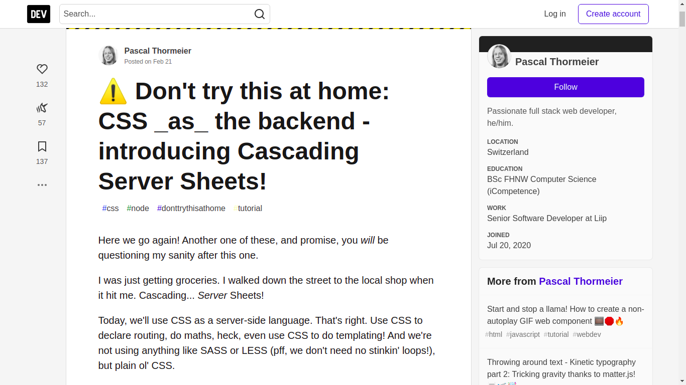
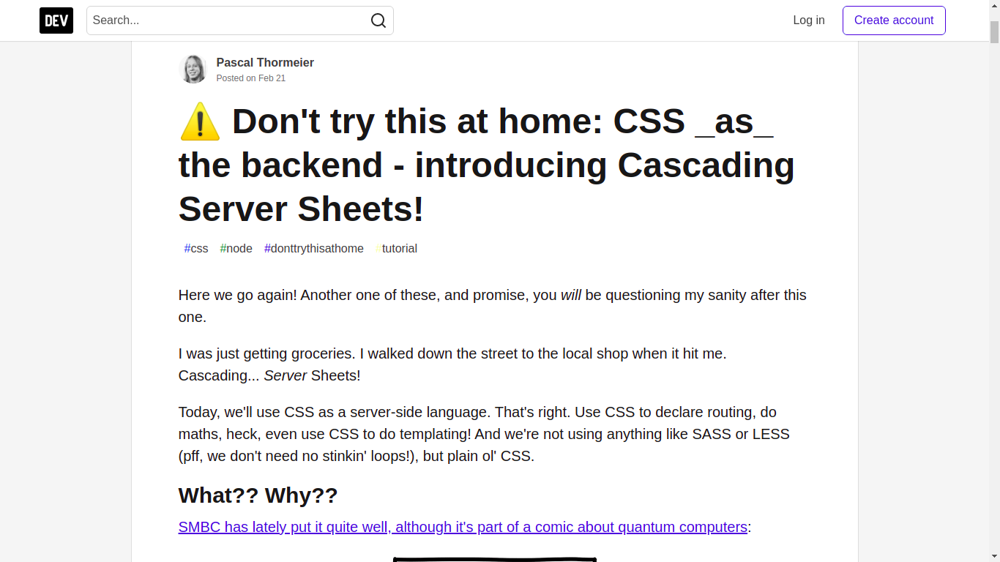

# DEV Community Zen Mode

Hello World! 

This extension is inspired by the lack of zen mode extensions for [Dev Community](https://dev.to/) on chrome store.
Feel free to fork it or make PR if you know what you are doing 🤓

I just hated writing those 5 lines of code every time I wanna read an article without the stupid Aside filling half my screen, so I spent sometime to learn how to make a chrome extension so I won't have to write them ever again 😂

|Before | After| 
| :-: | :-: |
| | |

## 🚀 Getting Started

- Open terminal
- git clone `https://github.com/mazenadel19/DevZen.git`
- Open `chrome://extensions/` in your browser
- Switch the developer mode on (you will find it on the top right)
- Click on `Load unpackaged` (you will find it on the top left under the hamburger menu ) and navigate to where you've installed DevZen
- Click on `Open` and you will see the extension added in your extensions list

and that's it! you can now go to [Dev Community](https://dev.to/) and read the articles you like free from all the distractions!
